# Markdown Torture Test 😈

## 1. Text Formatting

- _Italic_
- **Bold**
- ~~Strikethrough~~
- `Inline code`

> Blockquote example with **bold** and _italic_ inside.

---

## 2. Lists

### Unordered

- Item A
  - Nested A.1
  - Nested A.2
- Item B

### Ordered

1. Step 1
2. Step 2
   1. Sub-step 2.1
   2. Sub-step 2.2
3. Step 3

---

## 3. Code Blocks

```js
function hello(name) {
  console.log(`Hello, ${name}!`);
}
hello('Markdown');
```

```python
def factorial(n):
    return 1 if n <= 1 else n * factorial(n-1)
```

---

## 4. Tables

| Feature       | Supported? | Notes                        |
| ------------- | ---------- | ---------------------------- |
| **Bold text** | ✅ Yes     | Works inside tables          |
| _Italic text_ | ✅ Yes     | Markdown in tables supported |
| Inline `code` | ✅ Yes     | Useful for configs           |
| Images        | ⚠️ Partial | Depends on renderer          |

## 5. Images

Inline:  


With HTML (style control):  


---

## 6. Links

- [GitHub](https://github.com)
- [OpenAI](https://openai.com)

---

## 7. Math 🎓

Inline math: $E = mc^2$

Escaped inline math (AI-style export): **\$ \alpha + \beta = \gamma \$**

Block math:

$$
\int_{0}^{\infty} e^{-x^2} \, dx = \frac{\sqrt{\pi}}{2}
$$

Matrix example:

$$
A = \begin{bmatrix}
1 & 2 & 3 \\
4 & 5 & 6
\end{bmatrix}
$$

Optimization problem:

$$
\min_{X} \| X \|_* \quad \text{s.t. } X_{ij} = R_{ij}, \, (i,j) \in \Omega
$$

---

## 8. Mixed Content

> **Task**: Implement $\phi(x)$ and test inside Markdown

### Mermaid — Flowchart

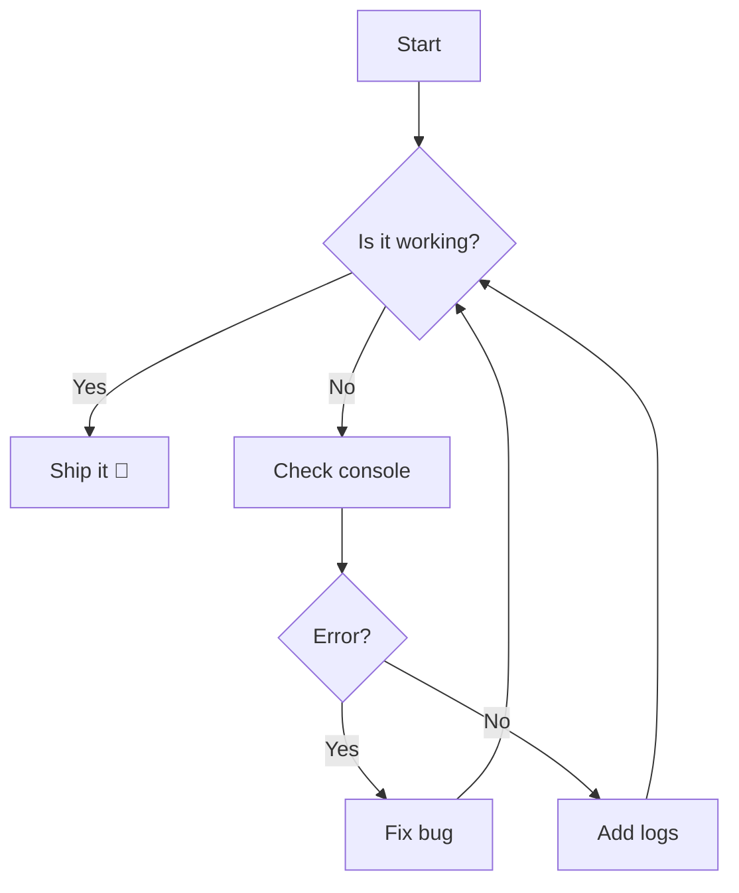

### Mermaid — Sequence Diagram

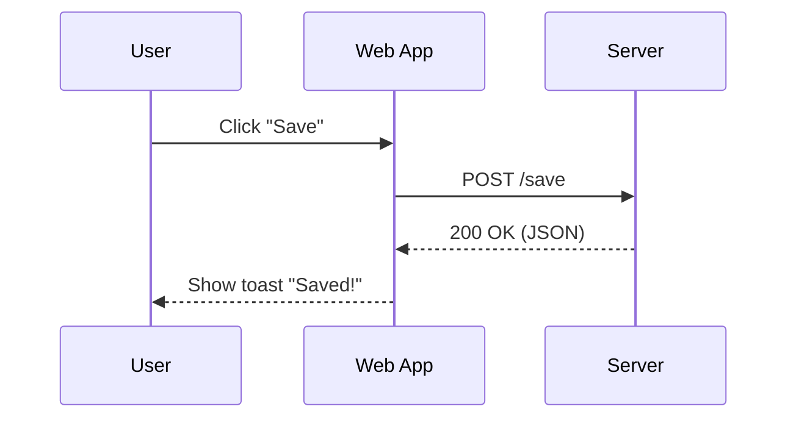

### Mermaid — State Diagram

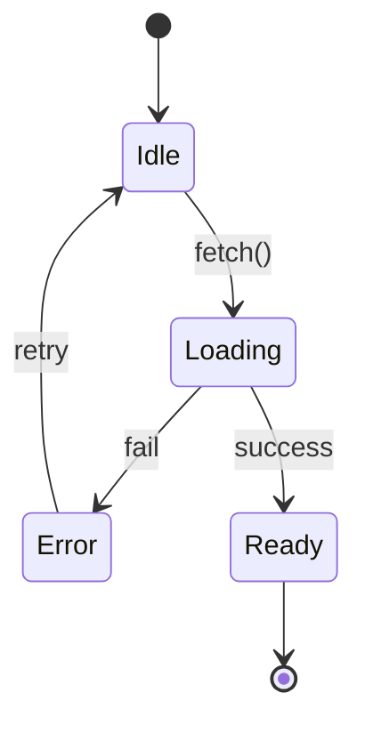

### Mermaid — Class Diagram

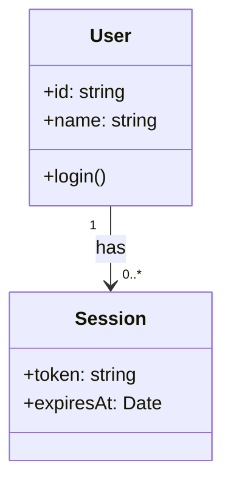

### Mermaid — ER Diagram

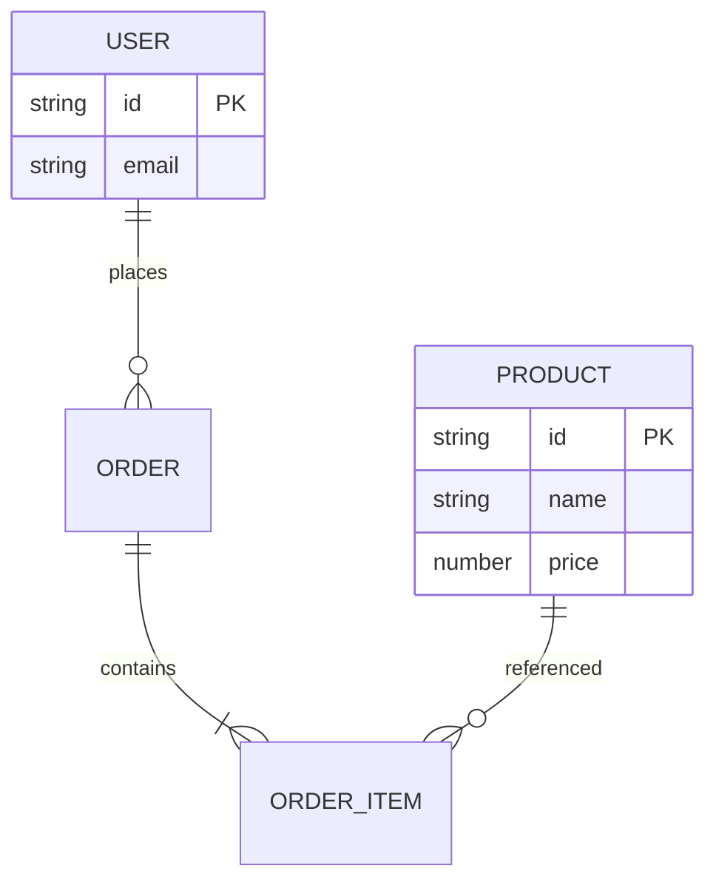

### Mermaid — Gantt

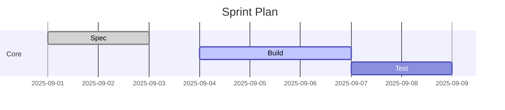

### Mermaid — Pie

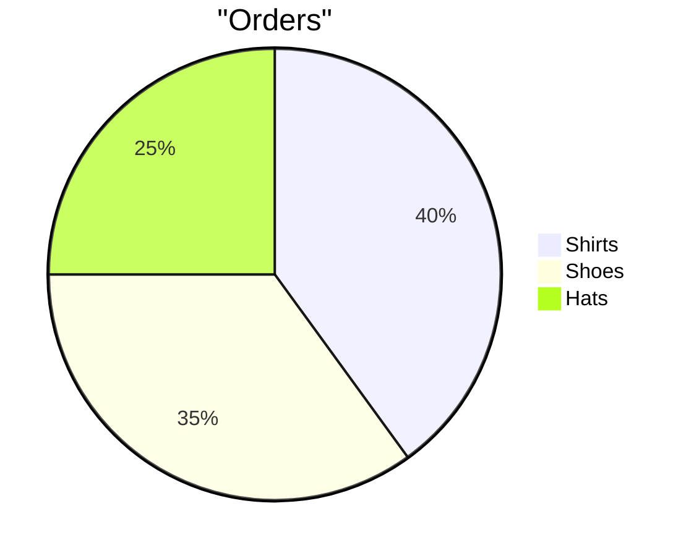

---

## Graphviz / DOT

### DOT — Directed graph with clusters

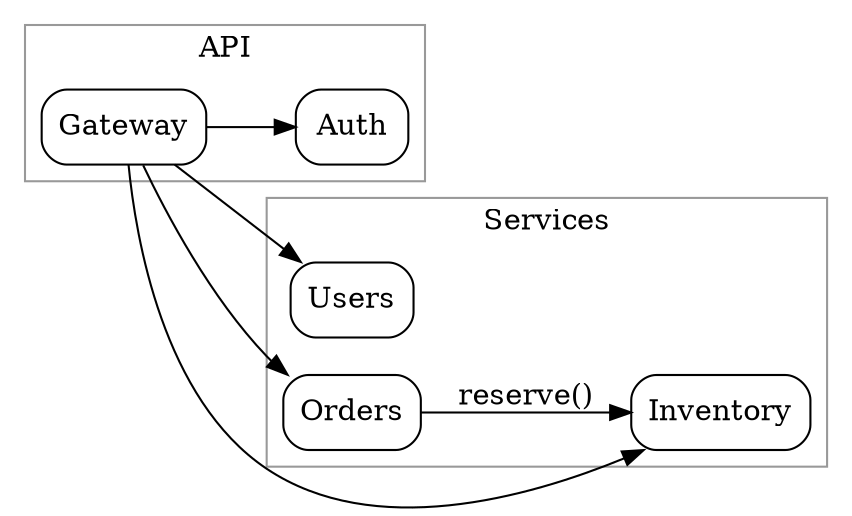

### DOT — Undirected graph

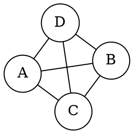

### DOT — Records / Struct-like nodes

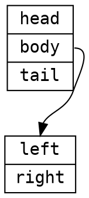

### DOT — Edge styles & attributes

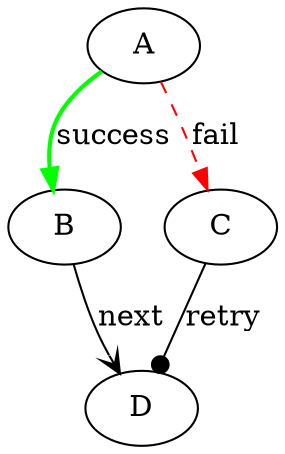
