# Markdown Torture Test 😈

## Some Text

**Exam Material Notes**
These notes are designed for easy learning and exam preparation. Concepts are broken down with definitions, algorithms, pros/cons, formulas, and examples. Key formulas are bolded for quick recall. Diagrams are included via generated visuals (cite them as [number] – sketch similar in exams). Focus on derivations, comparisons, and applications for long-answer questions. Practice implementing in Python (e.g., scikit-learn for K-means/PCA).

Unsupervised learning involves finding patterns in unlabeled data, unlike supervised learning which uses labels.

---

## 1. Clustering

Clustering groups similar data points without labels. It's useful for segmentation, anomaly detection, and data exploration.

### 1.1 K-means

- **Definition**: Partitions data into K clusters by minimizing the within-cluster variance (objective: **$ J = \sum*{i=1}^{K} \sum*{x \in C_i} \| x - \mu_i \|^2 $**, where $\mu_i$ is the centroid).
- **Algorithm Steps**:

1. Initialize K centroids (randomly or via K-means++ for better results).
2. Assign each point to the nearest centroid (using Euclidean distance).
3. Update centroids as the mean of points in each cluster.
4. Repeat until convergence (e.g., centroids don't change much).

- **Hyperparameters**: K (choose via elbow method or silhouette score).
- **Advantages**: Simple, fast for large datasets.
- **Disadvantages**: Assumes spherical clusters; sensitive to outliers and initialization; requires predefined K.
- **Example**: Customer segmentation based on purchase history.
- **Evaluation**: Inertia (J), Davies-Bouldin index.

(see the generated image above)

### 1.2 Kernel K-means

- **Definition**: Extends K-means to non-linear clusters by mapping data to a higher-dimensional space using a kernel function (e.g., RBF: **$ K(x, y) = \exp(-\gamma \| x - y \|^2) $**).
- **How it Works**: Computes distances in kernel space without explicit mapping (kernel trick). The objective is similar to K-means but uses kernel matrix.
- **Algorithm**: Similar to K-means, but assignments use kernel-based distances.
- **Advantages**: Handles complex shapes (e.g., moons or circles).
- **Disadvantages**: Higher computational cost; choice of kernel and parameters is crucial.
- **Example**: Image segmentation where clusters are not linearly separable.

---

## 1. Text Formatting

- _Italic_
- **Bold**
- ~~Strikethrough~~
- `Inline code`
- [GitHub](https://github.com)

> Blockquote example with **bold** and _italic_ inside.

---

## 2. Lists

### Unordered

- Item A
  - Nested A.1
  - Nested A.2
- Item B

### Ordered

1. Step 1
2. Step 2
   1. Sub-step 2.1
   2. Sub-step 2.2
3. Step 3

---

## 3. Code Blocks

```js
function hello(name) {
  console.log(`Hello, ${name}!`);
}
hello('Markdown');
```

```python
def factorial(n):
    return 1 if n <= 1 else n * factorial(n-1)
```

---

## 4. Tables

| Feature       | Supported? | Notes                        |
| ------------- | ---------- | ---------------------------- |
| **Bold text** | ✅ Yes     | Works inside tables          |
| _Italic text_ | ✅ Yes     | Markdown in tables supported |
| Inline `code` | ✅ Yes     | Useful for configs           |
| Images        | ⚠️ Partial | Depends on renderer          |

## 5. Images

Inline:  


With HTML (style control):  


---

## 6. Links

- [GitHub](https://github.com)
- [OpenAI](https://openai.com)

---

## 7. Math 🎓

Inline math: $E = mc^2$

Escaped inline math (AI-style export): **\$ \alpha + \beta = \gamma \$**

Block math:

$$
\int_{0}^{\infty} e^{-x^2} \, dx = \frac{\sqrt{\pi}}{2}
$$

Matrix example:

$$
A = \begin{bmatrix}
1 & 2 & 3 \\
4 & 5 & 6
\end{bmatrix}
$$

Optimization problem:

$$
\min_{X} \| X \|_* \quad \text{s.t. } X_{ij} = R_{ij}, \, (i,j) \in \Omega
$$

---

## 8. Mixed Content

> **Task**: Implement $\phi(x)$ and test inside Markdown

### Mermaid — Flowchart

```mermaid
flowchart TD
  A[Start] --> B{Is it working?}
  B -- Yes --> C[Ship it 🚀]
  B -- No --> D[Check console]
  D --> E{Error?}
  E -- Yes --> F[Fix bug]
  E -- No --> G[Add logs]
  F --> B
  G --> B
```



### Mermaid — Sequence Diagram


### Mermaid — State Diagram


### Mermaid — Class Diagram


### Mermaid — ER Diagram


### Mermaid — Gantt


### Mermaid — Pie


---

## Graphviz / DOT

### 🎨 Supervised Learning — Modern Concept Map (Graphviz / DOT)

```dot
digraph SupervisedLearning {
    graph [bgcolor="#f8f9fa", fontname="Helvetica", fontsize=12, splines=ortho, nodesep=0.5, ranksep=0.75, pad=0.4];
    node [shape=rect, style="rounded,filled", fontname="Helvetica", fontsize=11, color="#dee2e6", penwidth=1.2];
    edge [color="#adb5bd", arrowsize=0.7];

    subgraph cluster_supervised {
        label="Supervised Learning";
        color="#ced4da";
        style="rounded";
        fillcolor="#ffffff";
        node [fillcolor="#e9ecef"];

        Regression [label="Regression\n(Continuous Output)", fillcolor="#cfe2ff"];
        Classification [label="Classification\n(Categorical Output)", fillcolor="#ffe8cc"];
    }

    # --- Distance-based Methods ---
    subgraph cluster_distance {
        label="Distance-Based Methods";
        style="rounded,filled";
        color="#adb5bd";
        fillcolor="#f1f3f5";

        KNN [label="K-Nearest Neighbours (KNN)", fillcolor="#d0ebff"];
        Distance [label="Distance Metrics\n(Euclidean, Manhattan)", fillcolor="#e7f5ff"];
    }

    # --- Linear Models ---
    subgraph cluster_linear {
        label="Linear Models";
        style="rounded,filled";
        color="#adb5bd";
        fillcolor="#f1f3f5";

        LinReg [label="Linear Regression", fillcolor="#e6fcf5"];
        LogReg [label="Logistic Regression", fillcolor="#d3f9d8"];
        GLM [label="Generalized Linear Models (GLM)", fillcolor="#c3fae8"];
    }

    # --- Probabilistic Models ---
    subgraph cluster_bayes {
        label="Probabilistic Models";
        style="rounded,filled";
        color="#adb5bd";
        fillcolor="#f1f3f5";

        NaiveBayes [label="Naive Bayes", fillcolor="#fff3bf"];
        ProbTheory [label="Probability Theory\n(Bayes’ Theorem)", fillcolor="#ffec99"];
    }

    # --- Decision Trees ---
    subgraph cluster_trees {
        label="Decision Trees";
        style="rounded,filled";
        color="#adb5bd";
        fillcolor="#f1f3f5";

        Tree [label="Decision Tree", fillcolor="#ffd8a8"];
        InfoGain [label="Information Gain / Gini Index", fillcolor="#ffe8cc"];
        Ensemble [label="Ensemble Methods\n(Random Forest, GBM)", fillcolor="#ffe066"];
    }

    # --- SVM & Kernel Methods ---
    subgraph cluster_svm {
        label="SVM & Kernel Methods";
        style="rounded,filled";
        color="#adb5bd";
        fillcolor="#f1f3f5";

        SVM [label="Support Vector Machines", fillcolor="#e5dbff"];
        Kernel [label="Kernel Trick\n(RBF, Polynomial)", fillcolor="#d0bfff"];
        Margin [label="Maximal Margin Classifier", fillcolor="#b197fc"];
    }

    # --- Connections ---
    Regression -> LinReg;
    Classification -> LogReg;
    KNN -> Distance;
    LinReg -> GLM;
    LogReg -> GLM;
    NaiveBayes -> ProbTheory;
    Tree -> InfoGain;
    Tree -> Ensemble;
    SVM -> Kernel;
    SVM -> Margin;

    # --- Main Topic Links ---
    Regression -> KNN [style=dashed];
    Classification -> NaiveBayes [style=dashed];
    Classification -> Tree [style=dashed];
    Classification -> SVM [style=dashed];

    # --- Titles ---
    label="📘 Supervised Learning — Modern Concept Map";
    labelloc="t";
    fontsize=16;
    fontcolor="#212529";
}
```



### DOT — Directed graph with clusters


### DOT — Undirected graph


### DOT — Records / Struct-like nodes


### DOT — Edge styles & attributes


