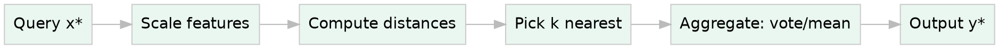
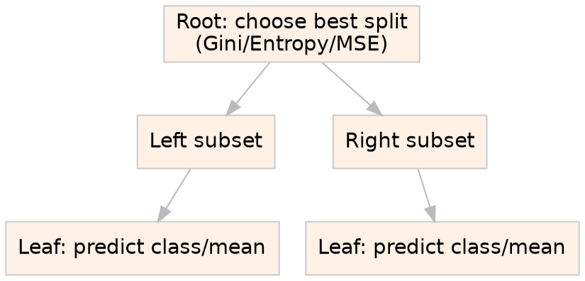
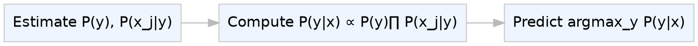
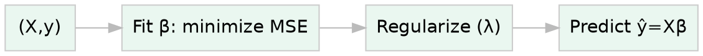
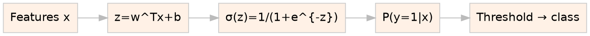
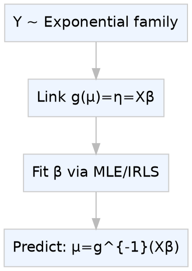
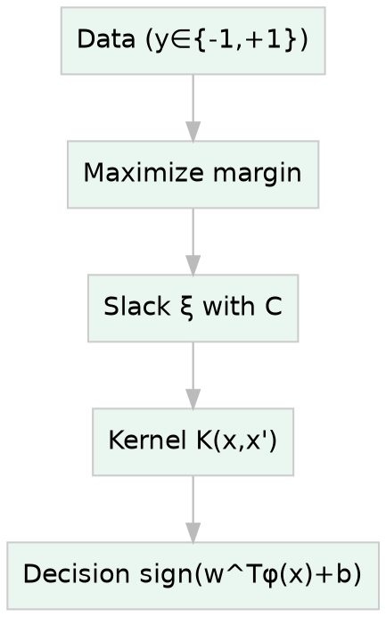
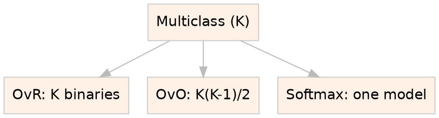
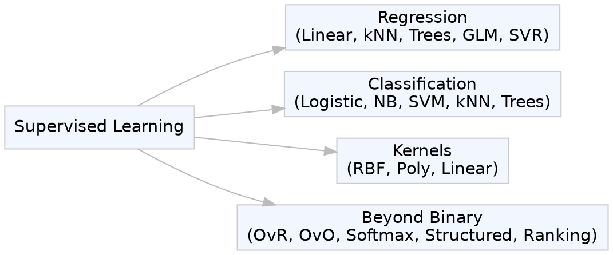

# Module: Supervised Learning (Regression/Classification)

These notes are designed for final-year undergraduate exams. Each topic follows a consistent structure: introduction, core concepts, compact formulas in LaTeX, DOT diagrams you can render with Graphviz, real-life examples, tips, mistakes, and exam-style summaries. After you review one section, try a quick self-check: can you state the goal, the loss, and one pitfall? If you share your university syllabus or past papers, I can tailor emphasis and add targeted practice.

---

## 1) Supervised Learning: Overview (Regression vs Classification)

### Introduction

Supervised learning learns a mapping from inputs to outputs using labeled examples. We choose a model $$f_\theta$$ and fit it to minimize a loss on training data, aiming to generalize to unseen data.

### Core Concepts and Definitions

- Labeled data: pairs $$(x_i, y_i)$$. Features $$x$$, target $$y$$.
- Hypothesis/model: $$\hat{y} = f_\theta(x)$$.
- Loss and risk: empirical risk $$\min_\theta \sum_i \ell(f_\theta(x_i), y_i)$$.
- Tasks: regression (continuous $$y$$), classification (categorical $$y$$).
- Generalization: performance on new data; controlled via regularization, validation, and proper model selection.

### Diagram (pipeline)

```dot
digraph G {
  graph [rankdir=LR, fontname=Helvetica];
  node [shape=rounded, style=filled, fillcolor="#eef5ff", color="#cccccc", fontname=Helvetica];
  edge [color="#bbbbbb"];
  D[label="Labeled Data (x,y)"];
  Split[label="Split: Train/Val/Test"];
  Train[label="Train: minimize loss"];
  Select[label="Model select + regularize"];
  Predict[label="Predict on new x"];
  Eval[label="Evaluate metrics"];
  D -> Split -> Train -> Select -> Predict -> Eval;
}
```

### Real-life Examples or Analogies

- Regression: $$y$$ = house price given $$x$$=area, location, age.
- Classification: spam vs ham emails based on word features.

### Important Formulas / Keywords

- Empirical risk: $$\hat{R}(\theta)=\frac{1}{n}\sum_{i=1}^n \ell(f_\theta(x_i), y_i)$$.
- Regularization: $$\hat{R}(\theta)+\lambda \Omega(\theta)$$ where $$\Omega$$ controls complexity.
- Metrics: regression (RMSE, MAE, $$R^2$$); classification (accuracy, precision, recall, F1, ROC-AUC, PR-AUC).

### Tips to Memorize

- “R for Real numbers” (regression), “C for Classes” (classification).
- Pipeline mnemonic: PIPE = Problem → Inputs/labels → Predictive model → Evaluation.

### Common Mistakes to Avoid

- Using accuracy for highly imbalanced classes; prefer precision/recall/F1/PR-AUC.
- Tuning hyperparameters on the test set (leaks performance).

### Summary or Revision Points

- Learn $$f_\theta$$ from labeled data by minimizing loss with regularization.
- Match metric to task and class balance; use validation for model selection.

---

## 2) Distance-based Methods and k-Nearest Neighbours (kNN)

### Introduction

Distance-based methods predict using similarity. kNN stores training data; for a query $$x^*$$, it finds the $$k$$ nearest neighbors and aggregates their labels/values.

### Core Concepts and Definitions

- Distance metric $$d(x,x')$$: Euclidean $$\ell_2$$, Manhattan $$\ell_1$$, cosine, Minkowski.
- kNN classification: majority vote among nearest $$k$$ neighbors.
- kNN regression: average (or distance-weighted average) of neighbors’ $$y$$-values.
- Non-parametric, “lazy” learning: minimal training; computation happens at query time.
- Feature scaling often required for meaningful distances.

### Diagram (workflow)

### Real-life Examples or Analogies

- Recommending a product by looking at “nearest” customers.
- Estimating house price from prices of most similar houses.

### Important Formulas / Keywords

- Euclidean: $$d(x,x')=\sqrt{\sum_j (x_j-x'_j)^2}$$.
- Weighted kNN: $$\hat{y}(x^*)=\frac{\sum_{i\in N_k} w_i y_i}{\sum_{i\in N_k} w_i}$$, with $$w_i=\frac{1}{d(x^*,x_i)+\varepsilon}$$.
- Curse of dimensionality: distances become less discriminative as $$p$$ grows.
- Complexity: naive query $$\mathcal{O}(np)$$; use KD-trees/ball trees when feasible.

### Tips to Memorize

- “k closest friends decide.” Remember SKM: Scale → choose $$k$$ → choose Metric.

### Common Mistakes to Avoid

- Not scaling features; one feature can dominate distance.
- Too small $$k$$ → noisy; too large $$k$$ → biased toward majority class.

### Summary or Revision Points

- Simple, strong baseline; key choices: $$k$$, metric, scaling, tie-breaking.

---

## 3) Decision Trees

### Introduction

Decision trees split the feature space using rules that reduce impurity. They handle nonlinearity and mixed feature types and are easy to interpret.

### Core Concepts and Definitions

- Structure: root → internal nodes (tests) → leaves (predictions).
- Splitting criteria (classification): entropy, Gini; (regression): variance/MSE.
- Stopping/pruning: max depth, min samples per leaf, cost-complexity pruning.
- Pros: interpretability, handles missing values (surrogates), no scaling needed. Cons: overfitting without control.

### Diagram (growth)

### Real-life Examples or Analogies

- Credit approval using thresholds on income, history.
- Medical triage with simple rule paths.

### Important Formulas / Keywords

- Entropy: $$H(S)=-\sum_c p_c\log_2 p_c$$.
- Gini: $$G(S)=1-\sum_c p_c^2$$.
- Information gain: $$IG=H(S)-\sum_i \frac{|S_i|}{|S|}H(S_i)$$.
- Regression impurity: node MSE $$=\frac{1}{|S|}\sum_{i\in S}(y_i-\bar{y}_S)^2$$.

### Tips to Memorize

- “GE-M”: Gini, Entropy for classification; MSE for regression.
- Build deep, then prune back (for generalization).

### Common Mistakes to Avoid

- Allowing unconstrained depth → overfitting. Use pruning or depth limits.
- Choosing splits by accuracy instead of impurity in imbalanced data.

### Summary or Revision Points

- Trees partition space to reduce impurity; interpretability is key. Control complexity to prevent overfitting.

---

## 4) Naive Bayes (NB)

### Introduction

Naive Bayes is a probabilistic classifier applying Bayes’ rule with a conditional independence assumption. It is very effective for high-dimensional sparse data (e.g., text).

### Core Concepts and Definitions

- Bayes’ theorem: $$P(y\mid x)=\frac{P(x\mid y)P(y)}{P(x)}\propto P(x\mid y)P(y)$$.
- Naive assumption: $$P(x\mid y)=\prod_{j} P(x_j\mid y)$$.
- Variants: Gaussian NB (continuous), Multinomial NB (counts), Bernoulli NB (binary features).
- Smoothing avoids zero probabilities (Laplace/Lidstone).

### Diagram (flow)

### Real-life Examples or Analogies

- Spam detection using word counts (Multinomial NB).
- Sentiment analysis with word presence (Bernoulli NB).

### Important Formulas / Keywords

- Decision rule: $$\hat{y}=\arg\max_y \big[P(y)\prod_j P(x_j\mid y)\big]$$.
- Laplace smoothing (Multinomial): $$\hat{\theta}_{yi}=\frac{N_{yi}+\alpha}{N_{y}+\alpha n}$$, with $$\alpha=1$$ commonly used.
- Gaussian NB: $$x_j\mid y \sim \mathcal{N}(\mu_{jy},\sigma_{jy}^2)$$ and use class-conditional densities.

### Tips to Memorize

- “GMB” variants: Gaussian, Multinomial, Bernoulli. “NB = Naively Break into products.”

### Common Mistakes to Avoid

- Forgetting smoothing → zeroing entire posteriors.
- Applying Multinomial NB to continuous data without discretization.

### Summary or Revision Points

- NB = Bayes + independence; fast, strong baseline for text; pick variant by feature type and apply smoothing.

---

## 5) Linear Models: Linear Regression

### Introduction

Linear regression models the conditional mean of $$y$$ as a linear function of features. It’s a foundational method and a solid baseline for regression.

### Core Concepts and Definitions

- Model: $$\hat{y}=\beta_0+\sum_{j=1}^p \beta_j x_j = X\beta$$.
- Objective (OLS): $$\min_\beta \sum_{i=1}^n (y_i-\hat{y}_i)^2 = \min_\beta \lVert y - X\beta \rVert_2^2$$.
- Fitting: normal equations or gradient-based optimization.
- Regularization: Ridge ($$\ell_2$$), Lasso ($$\ell_1$$), Elastic Net (mix of $$\ell_1$$, $$\ell_2$$).

### Diagram (training)

### Real-life Examples or Analogies

- Forecasting sales from price, ads, season.
- Calibrating sensors with linear response.

### Important Formulas / Keywords

- Closed-form (if $$X^TX$$ invertible): $$\hat{\beta}=(X^TX)^{-1}X^Ty$$.
- Ridge: $$\min_\beta \lVert y-X\beta \rVert_2^2+\lambda\lVert\beta\rVert_2^2$$.
- Lasso: $$\min_\beta \lVert y-X\beta \rVert_2^2+\lambda\lVert\beta\rVert_1$$.
- Metrics: $$\text{RMSE}=\sqrt{\tfrac{1}{n}\sum (y_i-\hat{y}_i)^2}$$, $$\text{MAE}=\tfrac{1}{n}\sum |y_i-\hat{y}_i|$$, $$R^2=1-\tfrac{\sum (y_i-\hat{y}_i)^2}{\sum (y_i-\bar{y})^2}$$.

### Tips to Memorize

- “RLL”: Ridge=$$\ell_2$$ shrinks; Lasso=$$\ell_1$$ makes sparse; Elastic Net=mix.

### Common Mistakes to Avoid

- Relying only on $$R^2$$; always check residual plots and RMSE/MAE.
- Skipping feature scaling before regularization or gradient descent.

### Summary or Revision Points

- Linear regression minimizes squared error; use regularization to reduce overfitting; evaluate with appropriate metrics.

---

## 6) Logistic Regression (Binary and Multiclass)

### Introduction

Logistic regression models $$P(y=1\mid x)$$ with a logistic (sigmoid) link on a linear score. Despite its name, it is a linear classifier with probabilistic outputs.

### Core Concepts and Definitions

- Score: $$z=w^Tx+b$$. Sigmoid: $$\sigma(z)=\frac{1}{1+e^{-z}}$$.
- Probability: $$P(y=1\mid x)=\sigma(w^Tx+b)$$. Decision: predict 1 if $$P>\tau$$ (often $$\tau=0.5$$).
- Loss: cross-entropy $$-\sum_i [y_i\log p_i+(1-y_i)\log(1-p_i)]$$. Optimization via gradient descent, Newton, or LBFGS.
- Regularization: $$\ell_2$$, $$\ell_1$$. Multiclass via softmax (see Topic 9).

### Diagram (flow)

### Real-life Examples or Analogies

- Credit default risk, click-through prediction, disease diagnosis.

### Important Formulas / Keywords

- Log-odds: $$\log\frac{p}{1-p}=w^Tx+b$$.
- Gradient: $$\nabla_w = X^T(p - y) + 2\lambda w$$ for $$\ell_2$$-regularized binary case.
- Calibration: change threshold $$\tau$$ to balance precision/recall.

### Tips to Memorize

- “Logistic → Log-odds linear in features.”

### Common Mistakes to Avoid

- Ignoring class imbalance; adjust threshold or use class weights.
- Interpreting coefficients without feature scaling or interaction terms.

### Summary or Revision Points

- Linear decision boundary with probabilistic output; optimize cross-entropy; tune regularization and threshold.

---

## 7) Generalized Linear Models (GLMs)

### Introduction

GLMs extend linear models to non-Gaussian targets by linking the mean $$\mu=\mathbb{E}[Y\mid X]$$ to a linear predictor via a link function $$g$$, i.e., $$g(\mu)=X\beta$$.

### Core Concepts and Definitions

- Components: distribution (from exponential family), linear predictor $$\eta=X\beta$$, link $$g$$.
- Examples: Gaussian–identity (linear regression), Bernoulli–logit (logistic), Poisson–log (count data), Gamma–log (positive skewed).
- Estimation: maximum likelihood; often via IRLS (iteratively reweighted least squares).

### Diagram (concept)

### Real-life Examples or Analogies

- Poisson regression for counts (e.g., calls per hour).
- Gamma regression for insurance claim sizes.

### Important Formulas / Keywords

- Canonical links: identity (Gaussian), logit (Bernoulli), log (Poisson).
- Deviance compares model fit to saturated model; dispersion affects variance.

### Tips to Memorize

- “Three Gs of GLM”: Gaussian/Identity, Bernoulli/Logit, Poisson/Log.

### Common Mistakes to Avoid

- Using Poisson when variance >> mean (overdispersion); consider Negative Binomial.
- Forgetting to use appropriate link for support (e.g., log for positive outcomes).

### Summary or Revision Points

- Choose distribution + link to match target; fit via MLE/IRLS; check dispersion and residuals.

---

## 8) Support Vector Machines (SVM) and Kernel Methods

### Introduction

SVMs find a decision boundary with maximum margin between classes. With kernels, SVMs model nonlinear boundaries by operating in an implicit feature space.

### Core Concepts and Definitions

- Hard-margin (separable): maximize margin subject to $$y_i(w^Tx_i+b)\ge 1$$.
- Soft-margin: allow slack $$\xi_i$$ with penalty $$C$$: $$\min_{w,b,\xi} \tfrac{1}{2}\lVert w\rVert^2 + C\sum_i \xi_i$$ s.t. $$y_i(w^Tx_i+b)\ge 1-\xi_i,\ \xi_i\ge 0$$.
- Hinge loss: $$\ell(y,f)=\max(0,1-yf)$$ for $$y\in\{-1,+1\}$$.
- Kernel trick: use $$K(x,x')=\langle \phi(x),\phi(x')\rangle$$ to compute in high-dimensional feature spaces without explicit $$\phi$$.
- Common kernels: linear $$K=x^Tx'$$, polynomial $$K=(\gamma x^Tx' + r)^d$$, RBF $$K=\exp(-\gamma\lVert x-x'\rVert^2)$$.

### Diagram (idea)

### Real-life Examples or Analogies

- Text classification (linear kernel) where features are high-dimensional sparse vectors.
- Image classification with RBF kernel for nonlinear boundaries.

### Important Formulas / Keywords

- Primal soft-margin (above); dual leads to support vectors with coefficients $$\alpha_i$$.
- Decision function (kernelized): $$f(x)=\text{sign}\big(\sum_i \alpha_i y_i K(x_i,x)+b\big)$$.
- Hyperparameters: $$C$$ trades margin vs misclassification; RBF $$\gamma$$ controls locality.

### Tips to Memorize

- “MSC”: Margin → Slack ($$C$$) → Kernel. High $$C$$ = less slack; low $$C$$ = more slack.

### Common Mistakes to Avoid

- Not scaling features; SVMs (especially RBF) are scale-sensitive.
- Tuning $$C$$/$$\gamma$$ without cross-validation → overfitting.

### Summary or Revision Points

- SVM maximizes margin; hinge loss drives large margins; kernels provide flexible nonlinearity.

---

## 9) Beyond Binary: Multiclass, Structured Outputs, Ranking

### Introduction

Many problems need more than two classes, structured predictions (sequences, trees), or ranked lists. Extend binary methods to these settings.

### Core Concepts and Definitions

- Multiclass strategies:
  - One-vs-Rest (OvR): train $$K$$ binary classifiers; pick class with highest score.
  - One-vs-One (OvO): train $$K(K-1)/2$$ pairwise classifiers with voting.
  - Multinomial (softmax): single model with $$P(y=c\mid x)=\frac{e^{w_c^Tx}}{\sum_k e^{w_k^Tx}}$$.
- Structured outputs: model dependencies among outputs (e.g., CRFs, structured SVMs) for sequences, segmentations.
- Ranking: learn a scoring function $$s(x)$$ so that relevant items rank higher; pairwise (e.g., RankSVM) or listwise losses.
- Metrics: macro/micro-F1 for multiclass; MAP, NDCG for ranking.

### Diagram (multiclass strategies)

### Real-life Examples or Analogies

- Multiclass: handwritten digit recognition (0–9).
- Structured: part-of-speech tagging, image segmentation.
- Ranking: search engines ordering results, top-N recommendations.

### Important Formulas / Keywords

- Softmax probabilities (above); loss: cross-entropy $$L=-\sum_i \log P(y_i\mid x_i)$$.
- Pairwise ranking constraint: encourage $$s(x^+) > s(x^-)$$ by a margin.
- Inference in structured models uses dynamic programming (e.g., Viterbi for sequences).

### Tips to Memorize

- “3M for multiclass”: OvR, OvO, Multinomial (softmax).
- Ranking metrics: “N then M”: NDCG first, MAP second in IR exams.

### Common Mistakes to Avoid

- Using only accuracy for class-imbalanced multiclass; prefer macro-F1.
- Ignoring output dependencies in structured tasks → suboptimal predictions.

### Summary or Revision Points

- Extend binary models via OvR/OvO/Softmax; structured methods capture label relations; ranking optimizes order-based metrics.

---

## 10) Mind Map (Quick Revision)

---

## 11) Comparative Table (Exam Snapshot)

| Algorithm           | Task           | Objective/Loss                         | Pros                                | Cons                            |
| ------------------- | -------------- | -------------------------------------- | ----------------------------------- | ------------------------------- | ----------------------- |
| kNN                 | Both           | Vote/mean of nearest via $$d(x,x')$$   | Simple, non-parametric              | Slow at query, needs scaling    |
| Decision Trees      | Both           | Reduce impurity (Gini/Entropy/MSE)     | Interpretable, handles nonlinearity | Overfits without pruning        |
| Naive Bayes         | Classification | Maximize $$P(y)\prod_j P(x_j           | y)$$                                | Fast, strong for text           | Independence assumption |
| Linear Regression   | Regression     | Minimize $$\lVert y-X\beta\rVert_2^2$$ | Interpretable baseline              | Sensitive to outliers           |
| Logistic Regression | Classification | Minimize cross-entropy                 | Probabilistic outputs               | Linear boundary                 |
| GLMs                | Both           | Link $$g(\mu)=X\beta$$ + MLE           | Matches target distribution         | Needs correct link/distribution |
| SVM                 | Both           | Max-margin with hinge loss             | Robust margins, kernelized          | Hyperparameter sensitive        |

---

## 12) Memory Hooks and Mnemonics

- Trees “GE-M”: Gini, Entropy, MSE.
- Regularization “RLL”: Ridge=$$\ell_2$$, Lasso=$$\ell_1$$, Elastic Net=mix.
- SVM “MSC”: Margin–Slack($$C$$)–Kernel.
- Multiclass “3M”: OvR, OvO, Multinomial.
- kNN “SKM”: Scale → $$k$$ → Metric.

---

## 13) High-Yield Exam Prompts (Answer Skeletons)

- kNN: define; distance metrics; effect of $$k$$; scaling; time complexity; pros/cons; tiny numeric example; curse of dimensionality.
- Decision Trees: impurities (formulas); info gain; stopping/pruning; example split; Gini vs entropy comparison; overfitting control.
- Naive Bayes: Bayes rule; independence assumption; variants (Gaussian/Multinomial/Bernoulli); Laplace smoothing formula; text example; limitations.
- Linear vs Logistic: model forms; losses (MSE vs cross-entropy); metrics; regularization; when to use which; interpretability.
- SVM + Kernels: margin intuition; soft vs hard margin; hinge loss; kernels (RBF, polynomial); roles of $$C$$ and $$\gamma$$; scaling.
- Multiclass/Structured/Ranking: OvR vs OvO vs softmax; structured prediction definition; ranking losses and metrics.

---

## 14) Quick Practice Prompts (Self-check)

- In one sentence: when is softmax preferred over OvR? What’s the trade-off?
- Write the hinge loss and explain when it is zero.
- For Multinomial NB, write the smoothed parameter estimate and explain $$\alpha$$.
- Why does kNN often degrade in very high dimensions? What can you change?

---

## 15) Optional References (for deeper reading)

- scikit-learn: Naive Bayes overview and variants.[1]
- scikit-learn: SVM user guide and SVC API.[2][3]
- Wikipedia: Support Vector Machine primer (geometry, margins).[4]
- Bernoulli/Multinomial NB tutorials and explanations.[5][6]

Note: Use these to cross-check formulas and deepen intuition before exams.

---

## 16) Final Revision Checklist

- For each algorithm, can you state: objective/loss, decision rule, two pros, two cons, and one tuning hyperparameter?
- Can you write the key formulas from memory: entropy, Gini, softmax, hinge loss, Ridge/Lasso objectives?
- Have you practiced picking metrics for imbalanced classification? ROC-AUC vs PR-AUC rationale?

If you tell me your course or grade level specifics (university, exam pattern), I can tailor the emphasis, add solved past questions, or generate a focused practice set next.

[1](https://scikit-learn.org/stable/modules/naive_bayes.html)
[2](https://scikit-learn.org/stable/modules/svm.html)
[3](https://scikit-learn.org/stable/modules/generated/sklearn.svm.SVC.html)
[4](https://en.wikipedia.org/wiki/Support_vector_machine)
[5](https://www.geeksforgeeks.org/machine-learning/bernoulli-naive-bayes/)
[6](https://en.wikipedia.org/wiki/Naive_Bayes_classifier)
[7](<https://mrcet.com/downloads/digital_notes/CSE/III%20Year/MACHINE%20LEARNING(R20A0525).pdf>)
[8](https://www.ibm.com/think/topics/supervised-learning)
[9](https://www.eicta.iitk.ac.in/knowledge-hub/machine-learning/supervised-learning-classification-and-regression-methods)
[10](https://www.scribd.com/document/557542870/Supervised-Learning-classification-and-regression)
[11](https://www.datacamp.com/blog/classification-machine-learning)
[12](https://svrec.ac.in/docs/CAI/lecture/ML.pdf)
[13](https://scikit-learn.org/stable/modules/generated/sklearn.metrics.hinge_loss.html)
[14](https://jecrcfoundation.com/wp-content/uploads/notes/btech/Information%20Technology/6th%20Semester/Machine%20Learning/ML-Unit-2.pdf)
[15](https://towardsdatascience.com/laplace-smoothing-in-naive-bayes-algorithm-9c237a8bdece/)
[16](https://www.studocu.com/in/document/anna-university/machine-learning/unit-ii-supervised-learning/98147395)
[17](https://arxiv.org/html/2408.09908v2)
[18](https://heycoach.in/blog/laplace-smoothing-in-naive-bayes/)
[19](https://kuleshov-group.github.io/aml-book/contents/lecture12-suppor-vector-machines.html)
[20](https://www.upgrad.com/blog/multinomial-naive-bayes-explained/)
